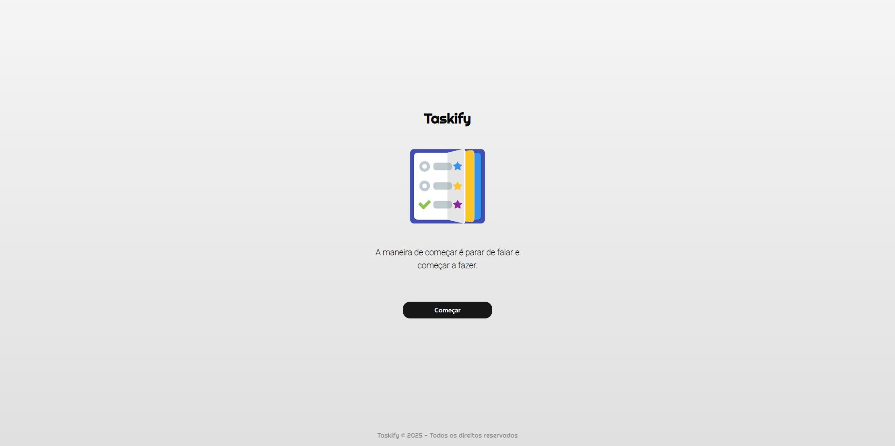
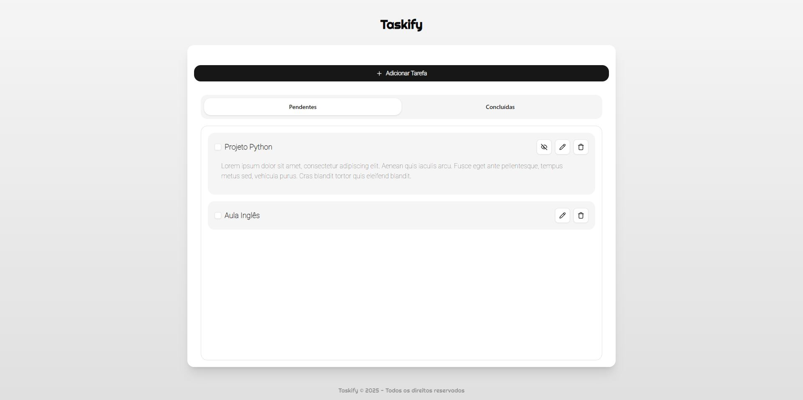
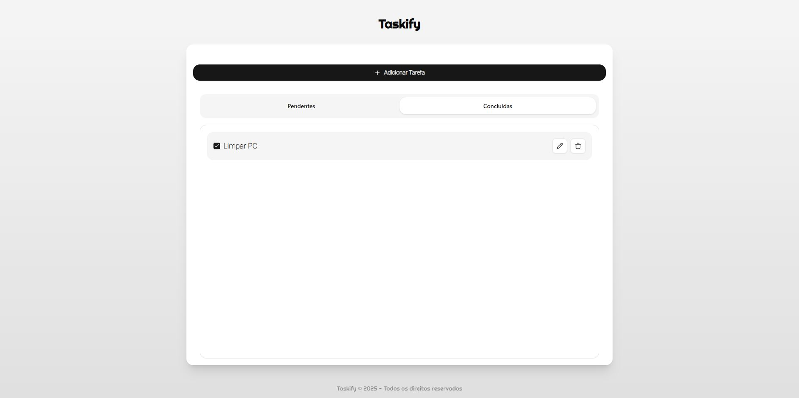
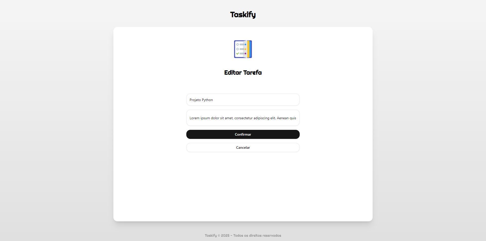
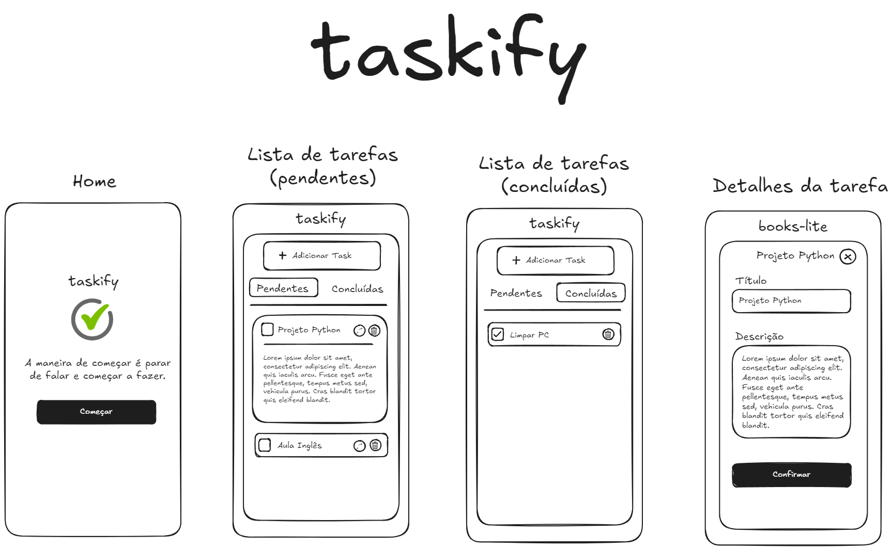

# Taskify - Lista de Tarefas.    

### Feito com Laravel + Vue + Mysql

<br>

<p align="center">




</p>

<br>

### Wireframe inicial

<br>

<p align="center">

</p>

<br>

## 📙Descrição deste Projeto:

Sistema fullstack de gerenciamento de tarefas (TODO list).

### 🛠️ Os requisitos do projeto:

Antes de começar, você vai precisar instalar em sua máquina as seguintes ferramentas:

- [Node](https://nodejs.org/en/)
- [PHP](https://www.php.net/downloads.php)
- [Composer](https://getcomposer.org/download/)
- [Mysql](https://dev.mysql.com/downloads/mysql/)

### Dependências de projeto:
- Node ^v22.14.0
- PHP 8.2+
- MySQL 8+
- Composer

### 📄 Documentação da API

A documentação da API está disponível via Postman.

- [Postman](https://documenter.getpostman.com/view/43696728/2sB2j7epuk)

Na pasta `docs` você pode encontrar os arquivos para importar no postman:
- [Collection](https://github.com/luanmarcal/taskify/blob/main/docs/taskify.postman_collection.json)
- [Environment](https://github.com/luanmarcal/taskify/blob/main/docs/taskify-test.postman_environment.json)

Após importar, você poderá visualizar e testar todos os endpoints da API diretamente pelo Postman, existem testes automatizados para isso, basta rodar.

<br>

## 🖥️ Instalação:

### 🤖 Rodando backend API

1. Clone o repositório:
```bash
git clone git@github.com:luanmarcal/taskify.git
```

2. Vá para o diretório da aplicação:
```bash
cd api
```

4. Para instalar as dependências do projeto:
```
composer install
```

5. Crie o arquivo `.env` na raiz do projeto `taskify/api/.env` e copie os valores do arquivo `.env.example`:
```
APP_NAME=Laravel
APP_ENV=local
APP_KEY=
APP_DEBUG=true
APP_URL=http://localhost
...
```

6. Configure o seu banco de dados em `.env`:
```
DB_CONNECTION=mysql
DB_HOST=127.0.0.1
DB_PORT=3306
DB_DATABASE=taskify_api
DB_USERNAME=root
DB_PASSWORD=123456789
```
Não se esqueça de fornece a senha caso possua.

7. Execute o comando para dados iniciais
```bash
php artisan migrate --seed
```
Caso receba uma pergunta do tipo `Would you like to create it?`, digite `yes`.

8. Na pasta da sua aplicação, execute o comando:
```bash
php artisan serve
```

<br>

#### 👾 Rodando frontend

1. Acesse a pasta do projeto no terminal/cmd:
```bash
cd frontend
```

2. Instale as dependências:
```
npm install
```

3. Execute a aplicação:
```bash
npm run dev
```

4. Acesse a URL no navegador (pode ser outra porta, verfique no terminal):
```bash
http://localhost:5173/
```
Atenção: Verifique se o backend está rodando na porta `8000`, pois o frontend irá consumir nesta porta.

<br>

<details>
    <summary><strong>Como você garantiria a escalabilidade deste código?</strong></summary>
    <h4>Estratégias aplicadas</h4>
    <ul>
        <li>Separação em camadas (Controller → Service → Model)</li>
        <li>Uso de interfaces para desacoplamento (ex: TaskServiceInterface)</li>
        <li>Enums para regras de negócio centralizadas</li>
        <li>Rotas versionadas (<code>/v1/tasks</code>)</li>
        <li>Consultas otimizadas no banco de dados</li>
        <li>Flags no frontend para evitar requisições redundantes</li>
        <li>Design responsivo no frontend, seguindo método mobile first</li>
        <li>Variáveis no Postman + testes automatizados para encontrar possíveis bugs após updates</li>
    </ul>
</details>

<details>
    <summary><strong>Qual princípio do SOLID você aplicou e por quê?</strong></summary>
    <h4>Princípios utilizados</h4>
    <ul>
        <li><strong>SRP (Single Responsibility Principle):</strong> cada classe tem uma única responsabilidade. Ex: TaskController apenas lida com requisições HTTP.</li>
        <li><strong>DIP (Dependency Inversion Principle):</strong> o controller depende de uma interface, não de uma implementação concreta, facilitando testes e mudanças.</li>
        <li><strong>OCP (Open/Closed Principle):</strong> o enum <code>TaskStatus</code> permite adicionar novos status sem modificar código já existente.</li>
    </ul>
</details>

<br>

## 👋😃 Obrigado por visitar
